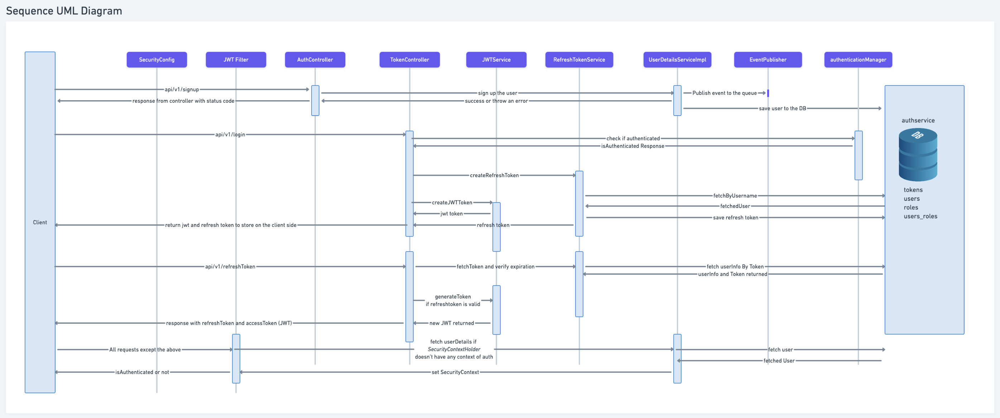
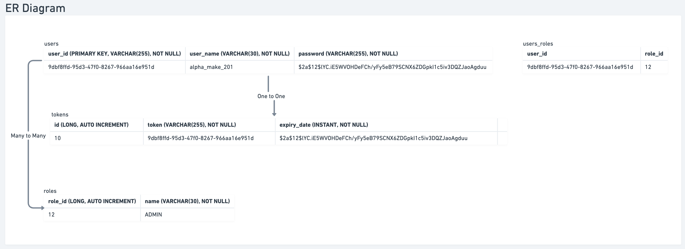

# Auth Service

### LLD
### Sequence UML Diagram

- SecurityConfig:- This class is about making Beans like applying filters that a request will go through before reaching to our controllers. Defining AuthenticationProvider and other related beans to be defined here.
- JWTFilter:- It is a filter that will be applied to every request apart from the requests which are mentioned to bypass this filter in SecurityConfig class like `/auth/v1/refreshToken, /auth/v1/signup, /auth/v1/login`
- AuthController:- Here we will define endpoints like `/auth/v1/signup`, `/ping`
- JwtService:- It is a class which will be used to generateToken, validateToken, using claims to get userName, expiration etc
- RefreshTokenService:- It is responsible for creation and validation of refresh tokens
- UserDetailsServiceImpl:- It is responsible for signing up the user, loading/fetching a user and this class will extend the `UserDetailsService` of *`org.springframework.security.core.userdetails`* package which is a spring security package.
- AuthenticationManager:- This comes from the spring boot security package that is responsible for authenticating a user based on its username and password.

### ER Diagram

# More About Auth Service

## **Table of contents:-**

- **Authentication and Authorization**
- **Tokens and their types**
- **Choice of tokens**
- **Java Servlets**
- **DB Choice**
- **Choice of DataStore**
- **User Flow**
- **Spring security**

---

## Authentication and Authorization

- Authentication

This is the process of verifying the person which can be verifying userName, password or token is signed or not. It doesn't specify that which particular resource this person can access. It doesn't talk about the permissions in general.

- Authorization

ROLE: ADMIN, USER

This is the process of checking user's permissions to access/modify certain resources. For ex: we might want users to read some resource but not to write it.

## Defining the token:-

**>> JWT (Json Web Tokens)**

It is primarily used for the Authentication, and it involves signing a token using private key and to verify the token a public key can be used which consumer will have but using public key one can not create tokens, instead they can verify it. The public/private key pair is mathematically related. Singing the token basically means only you can store the information like user_id etc. in the token, and it can not be tempered without having the private key.

pros:-

- It is very easy to verify the things, we do not need any datastore to store the prerequisites for the token verification.
- we can set the expiration date which allows consumers to verify based on the TTL also.
- Verifying tokens involves only CPU cycles not any IO from the user.

cons:-
- Invalidating or banning a user instantly is not possible because we have to mark the user_id or JWT id as banned in our data store, or otherwise we have to wait for the token to get expired because it is stored on the client side
- adding a new field in JWT will increase its size and it would have network impact if it has to be send on each request

**>> Opaque Tokens**
It doesn't store any information like user_id in the token instead it stores the primary key of the DB in itself that points to the entry of the user having information about the user. In this case we can use fast retrieve DBs also like redis.

pros:-

- It is simple and effective in authorization also to get an idea of the resources that a user can access
- It doesn't store the fields or used data in itself so having less network impact

cons:-
- might need to maintain a auth service or a dedicated server to do all the auth stuff which is not the case with JWT because JWT can be verified without maintaining any datastore

## Where to store the token:- Cookies vs Local Storage

we'll see the different attacks and so that we have to keep in mind before thinking about the storage on the client side.

## Choice of tokens:-

We will use two type of tokens. One will be the access-token and other will be refresh token. When client opens the app we will check if the token is expired or not on the client side. if it is expired then we will use the refresh token and send a request to the auth service and we will get the new access-token. Access token would be of short TTL like 15 mins and refresh token will be of ttl 1month.

we will use JWT for access-token which is short-lived and no need to store on the auth service side as it will be refreshed every 15 mins, and it will increase reads and writes on our DB. for refresh token we will use a DB to store user info and tokens.

---

HOW JWTs are Verified:- (Transmit JWTs on HTTPs)

1. **Extract the Signature:** The first step is to extract the signature from the JWT. This can be done by splitting the JWT into its three parts (header, payload, and signature) and then decoding the signature part from Base64Url format.
2. **Compute the Expected Signature:** Using the header and payload of the JWT, along with the known secret key, the expected signature is computed using the specified signing algorithm (e.g., HMAC SHA256). This is typically done by applying the same hashing algorithm to the concatenation of the Base64Url encoded header and payload, along with the secret key.
3. **Compare Signatures:** The computed signature is then compared to the extracted signature from the JWT. If the two signatures match, it indicates that the JWT has not been tampered with and was indeed signed with the expected secret key.
4. **Validate the Claims:** After the signature is verified, the claims contained in the payload of the JWT can be trusted. These claims may include information such as user ID, expiration time, issuer, etc. Additional checks can be performed on these claims to ensure they meet the requirements of the application (e.g., checking the expiration time to ensure the token is still valid).

---

## Choosing DB

## SQL vs NoSQL

**CAP Theorem and IOPS:-**

1. **Consistency (C)**: Every read receives the most recent write or an error. In other words, all nodes in the system return the same, most recent, consistent value for a given piece of data.
2. **Availability (A)**: Every request receives a response, without guarantee that it contains the most recent write. This means that the system remains operational even in the face of network partitions or node failures.
3. **Partition tolerance (P)**: The system continues to operate despite network partitions (communication breakdowns) that might cause some messages to be lost or delayed.

**SQL**

1. **Consistency**: SQL databases, especially those that follow ACID principles (Atomicity, Consistency, Isolation, Durability), prioritize strong consistency. When you perform a read operation, you're guaranteed to get the latest committed data.
2. **Availability**: SQL databases can sacrifice availability in favor of consistency. In the face of network failures or node crashes, SQL databases may choose to block requests until consistency can be guaranteed, ensuring that clients receive the most recent and accurate data.
3. **Partition Tolerance**: SQL databases typically prioritize consistency and availability over partition tolerance. While they can handle some network partitions, they often sacrifice partition tolerance to ensure data consistency and availability.
4. SQL are to support Complex queries and usually good for write heavy ops

**NoSQL**

1. **Consistency**: NoSQL databases vary in their approach to consistency. Some NoSQL databases prioritize strong consistency, similar to SQL databases, while others may offer eventual consistency, where all replicas converge to the same state over time but may temporarily diverge.
2. **Availability**: NoSQL databases often prioritize availability over consistency. In distributed NoSQL databases, individual nodes can continue to serve read and write requests even if they can't communicate with each other due to network partitions or failures. This ensures that the system remains operational even under adverse conditions.
3. **Partition Tolerance**: NoSQL databases are designed to be highly partition-tolerant. They are built to continue operating even when network partitions occur, allowing nodes to operate independently and reconcile differences later.
4. It is suitable for read heavy ops because of its high availability and partition tolerance